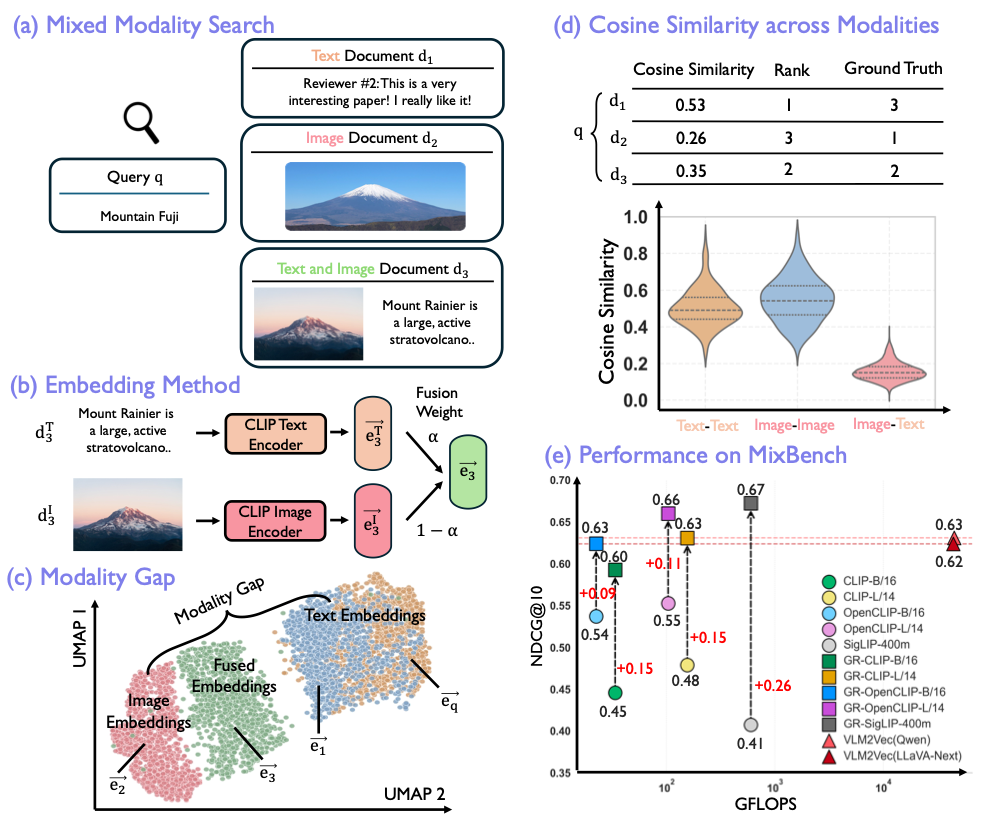

# Closing the Modality Gap for Mixed Modality Search

[](https://lbesson.mit-license.org/)
[](https://www.python.org/downloads/release/python-311/)
[](https://pytorch.org/get-started/previous-versions/#v25)
[](https://github.com/ambv/black)

This repo provides the source code of our paper: [Closing the Modality Gap for Mixed Modality Search](https://arxiv.org/abs/2507.19054).  

## 🔮 Abstract

Mixed modality search—retrieving information across a heterogeneous corpus composed of images, texts, and multimodal documents—is an important yet underexplored real-world application. In this work, we investigate how contrastive vision-language models, such as CLIP, perform on the mixed modality search task. Our analysis reveals a critical limitation: these models exhibit a pronounced modality gap in the embedding space, where image and text embeddings form distinct clusters, leading to intra-modal ranking bias and inter-modal fusion failure. To address this issue, we propose GR-CLIP, a lightweight post-hoc calibration method that removes the modality gap in CLIP’s embedding space. Evaluated on MixBench—the first benchmark specifically designed for mixed modality search—GR-CLIP improves NDCG@10 by up to 26 percentage points over CLIP, surpasses recent vision-language generative embedding models by 4 percentage points, while using $75 \times$ less compute.

</img>


## (a) Objective  
**GR-CLIP** tackles the challenge of **mixed modality search**—retrieving relevant items from a **heterogeneous corpus** composed of text, images, and multimodal documents. Although contrastive vision-language models like CLIP are trained to align modalities, they suffer from a **modality gap** that causes biased retrieval rankings and poor multimodal fusion. GR-CLIP provides a simple yet powerful fix.

---

## (b) Data  
We introduce **MixBench** ([HF Hub](https://huggingface.co/datasets/mixed-modality-search/MixBench25)), the first benchmark specifically designed for mixed modality search. It is constructed from four real-world multimodal datasets:

- **Google-WIT**
- **MSCOCO**
- **OVEN**
- **VisualNews**

Each dataset includes a mix of:
- **Text-only documents**
- **Image-only documents**
- **Image+Text multimodal documents**

This setting mirrors real-world retrieval systems (e.g., web search engines), where content spans diverse modality combinations.


---

## (c) Method: GR-CLIP  
**GR-CLIP** (Gap-Removed CLIP) is a **post-hoc calibration method** designed to eliminate the modality gap in CLIP’s embedding space. It works by:

- **Computing mean embeddings** for text and image modalities from calibration datasets (e.g., the training sets of MSCOCO, Google WIT, VisualNews, and OVEN).  
  👉 We provide the [embedding extraction script for CLIP, OpenCLIP, and SigLIP](src/extract_embedding_clip.py), which allows you to obtain modality-wise means for use in post-hoc correction.

- **Subtracting the means** from all query and corpus embeddings to align them into a shared embedding space. This removes modality-specific biases without affecting intra-modal similarity.

- **Applying this correction only at inference time — no retraining required.**  
  👉 We provide [retrieval code on MixBench](src/retrieval_mixbench.py) for CLIP, OpenCLIP, and SigLIP. Specifically, we compute all text and image embeddings, randomly mix them to form a heterogeneous corpus, and evaluate retrieval across modalities.  
  🔁 Optionally, you may skip the mixing step by directly using the provided `mixed_corpus.jsonl` files in MixBench for each sub-dataset to perform retrieval in the mix-retrieval setting.


This simple adjustment significantly improves both **retrieval accuracy** and **modality fusion performance**.


## (d) Usage

### Environment

Create a virtual environment and install the required packages using pip:
```
pip install -r requirements.txt
```

### Download Dataset

Please refer to the `ds_download.sh` script for downloading the dataset.

### Extract Your Own Embedding Mean with a CLIP-Based Model

You need to first use a CLIP-based model to extract embeddings for query-style text, corpus-style text, and natural-image-style images from your chosen or custom dataset. Then, compute the mean of each.

### Extract Embeddings with a CLIP-Based Model

We provide example code for extracting embeddings on the MSCOCO subset in `src/extract_emebdding_clip.py`.

### Extract Embeddings with VLM2Vec

Example code for using VLM2Vec to extract MSCOCO embeddings is provided in `vlm_example/get_embedddings.sh`.

### Evaluation

Evaluate using the extracted embeddings with a 1:1:1 ratio of pure text, pure image, and text-image mixed corpora. See `src/retrieval_mixbench.py` for the evaluation script.

---


## 🎯 Citation

If you use this repo in your research, please cite it as follows:
```
@article{MixedModalitySearch,
  title={Closing the Modality Gap for Mixed Modality Search},
  author={Binxu Li and Yuhui Zhang and Xiaohan Wang and Weixin Liang and Ludwig Schmidt and Serena Yeung-Levy},
  journal={arXiv preprint arXiv:2507.19054},
  year={2025}
}
```
